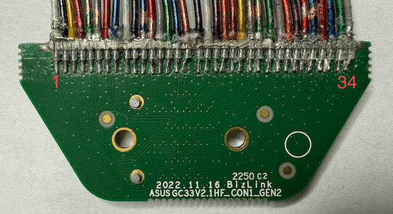
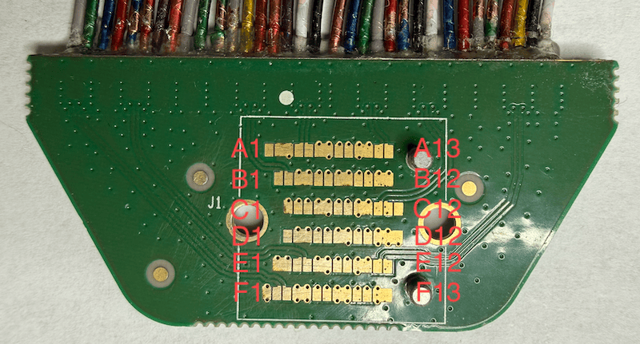
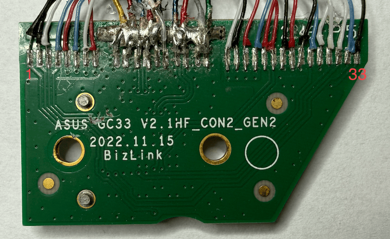
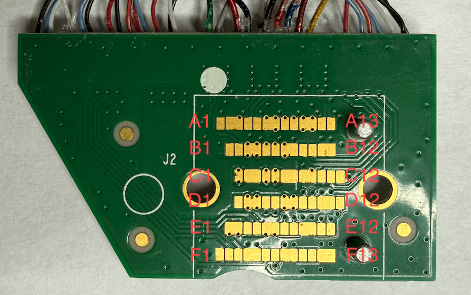

The 2023 ROG XG Mobile with RTX 4090 (Mobile) uses a different connector but the signals and functionality of the dock is the same. This version of the cable is not recommended for DIY because it cannot be easily bought as part and the J1/J2 connector is a proprietary part which cannot mate with anything found on the market (please let me know if you find otherwise). However, if you end up with one of these cables, you may be able to build a custom dock by de-soldering the wires from J1/J2 and soldering them directly to the board.

## J1

### Front

| Pin | Connector | Description   |
|-----|-----------|---------------|
| 1   | D20       | GPU_PCIE_CLKN |
| 2   | D19       | GPU_PCIE_CLKP |
| 3   | D11       | PCIENB_RXN6_C |
| 4   | D10       | PCIENB_RXP6_C |
| 5   | D2        | PCIENB_TXN5_C |
| 6   | D1        | PCIENB_TXP5_C |
| 7   | C23       | PCIENB_RXN3_C |
| 8   | C22       | PCIENB_RXP3_C |
| 9   | C26       | PCIENB_TXN4_C |
| 10  | C25       | PCIENB_TXP4_C |
| 11  | C17       | PCIENB_RXN2_C |
| 12  | C16       | PCIENB_RXP2_C |
| 13  | C8        | PCIENB_TXN1_C |
| 14  | C7        | PCIENB_TXP1_C |
| 15  | C5        | PCIENB_RXN0_C |
| 16  | C4        | PCIENB_RXP0_C |
| 17  | C2        | PCIENB_TXN0_C |
| 18  | C1        | PCIENB_TXP0_C |
| 19  | C14       | PCIENB_TXN2_C |
| 20  | C13       | PCIENB_TXP2_C |
| 21  | C11       | PCIENB_RXN1_C |
| 22  | C10       | PCIENB_RXP1_C |
| 23  | C20       | PCIENB_TXN3_C |
| 24  | C19       | PCIENB_TXP3_C |
| 25  | C29       | PCIENB_RXN4_C |
| 26  | C28       | PCIENB_RXP4_C |
| 27  | D8        | PCIENB_TXN6_C |
| 28  | D7        | PCIENB_TXP6_C |
| 29  | D5        | PCIENB_RXN5_C |
| 30  | D4        | PCIENB_RXP5_C |
| 31  | D17       | PCIENB_RXN7_C |
| 32  | D16       | PCIENB_RXP7_C |
| 33  | D14       | PCIENB_TXN7_C |
| 34  | D13       | PCIENB_TXP7_C |

### Back

| Pad | Connector | Description   | Pad | Connector | Description   | Pad | Connector | Description   | Pad | Connector | Description   | Pad | Connector | Description   | Pad | Connector | Description   |
|-----|-----------|---------------|-----|-----------|---------------|-----|-----------|---------------|-----|-----------|---------------|-----|-----------|---------------|-----|-----------|---------------|
| A1  | N/C       |               | B1  | C10       | PCIENB_RXP1_C | C1  | GND       |               | D1  | N/C       |               | E1  | GND       |               | F1  | GND       |               |
| A2  | GND       |               | B2  | C11       | PCIENB_RXN1_C | C2  | C19       | PCIENB_TXP3_C | D2  | GND       |               | E2  | GND       |               | F2  | D13       | PCIENB_TXP7_C |
| A3  | GND       |               | B3  | GND       |               | C3  | C20       | PCIENB_TXN3_C | D3  | GND       |               | E3  | D4        | PCIENB_RXP5_C | F3  | D14       | PCIENB_TXN7_C |
| A4  | C1        | PCIENB_TXP0_C | B4  | GND       |               | C4  | GND       |               | D4  | C28       | PCIENB_RXP4_C | E4  | D5        | PCIENB_RXN5_C | F4  | GND       |               |
| A5  | C2        | PCIENB_TXN0_C | B5  | C13       | PCIENB_TXP2_C | C5  | GND       |               | D5  | C29       | PCIENB_RXN4_C | E5  | GND       |               | F5  | GND       |               |
| A6  | GND       |               | B6  | C14       | PCIENB_TXN2_C | C6  | C22       | PCIENB_RXP3_C | D6  | GND       |               | E6  | GND       |               | F6  | D16       | PCIENB_RXP7_C |
| A7  | GND       |               | B7  | GND       |               | C7  | C23       | PCIENB_RXN3_C | D7  | GND       |               | E7  | D7        | PCIENB_TXP6_C | F7  | D17       | PCIENB_RXN7_C |
| A8  | C4        | PCIENB_RXP0_C | B8  | GND       |               | C8  | GND       |               | D8  | D1        | PCIENB_TXP5_C | E8  | D8        | PCIENB_TXN6_C | F8  | GND       |               |
| A9  | C5        | PCIENB_RXN0_C | B9  | C16       | PCIENB_RXP2_C | C9  | GND       |               | D9  | D2        | PCIENB_TXN5_C | E9  | GND       |               | F9  | GND       |               |
| A10 | GND       |               | B10 | C17       | PCIENB_RXN2_C | C10 | C25       | PCIENB_TXP4_C | D10 | GND       |               | E10 | GND       |               | F10 | D19       | GPU_PCIE_CLKP |
| A11 | GND       |               | B11 | GND       |               | C11 | C26       | PCIENB_TXN4_C | D11 | GND       |               | E11 | D10       | PCIENB_RXP6_C | F11 | D20       | GPU_PCIE_CLKN |
| A12 | C7        | PCIENB_TXP1_C | B12 | GND       |               | C12 | GND       |               | D12 | GND       |               | E12 | D11       | PCIENB_RXN6_C | F12 | GND       |               |
| A13 | C8        | PCIENB_TXN1_C |     |           |               |     |           |               |     |           |               |     |           |               | F13 | GND       |               |

## J2

### Front

| Pin | Connector | Description       |
|-----|-----------|-------------------|
| 1   | D27       | P_AC_LOSS_10      |
| 2   | D23       | CON_SW1_DET_NB    |
| 3   | D31       | CON_DET_NB        |
| 4   | C31       | CON_DET_TOWER#    |
| 5   | A8        | SBU1              |
| 6   | B8        | SBU2              |
| 7   | B5        | CC2               |
| 8   | A5        | CC1               |
| 9   | A11       | RX2+              |
| 10  | A10       | RX2-              |
| 11  | B2        | TX2+              |
| 12  | B3        | TX2-              |
| 13  | A2        | TX1+              |
| 14  | A3        | TX1-              |
| 15  | A6        | D+1               |
| 16  | A7        | D-1               |
| 17  | B11       | RX1+              |
| 18  | B10       | RX1-              |
| 19  | -         | +3V3              |
| 20  | -         | +3V3              |
| 21  | -         | +3V3              |
| 22  | -         | +3V3              |
| 23  | D22       | Reserve_NB        |
| 24  | D26       | EC_ACGPU_MCU_IRQ# |
| 25  | D29       | GPU_RST#          |
| 26  | D28       | DGPU_PWROK        |
| 27  | -         | WHITE_LED_N       |
| 28  | -         | LOCK_SW_N         |
| 29  | -         | RED_LED_N         |
| 30  | -         | SW1               |
| 31  | D25       | AGPU_SMB1_DAT     |
| 32  | D24       | AGPU_SMB1_CLK     |
| 33  | D30       | DGPU_PWR_EN#      |

### Back

| Pad | Connector | Description | Pad | Connector | Description | Pad | Connector | Description | Pad | Connector | Description       | Pad | Connector | Description   | Pad | Connector | Description  |
|-----|-----------|-------------|-----|-----------|-------------|-----|-----------|-------------|-----|-----------|-------------------|-----|-----------|---------------|-----|-----------|--------------|
| A1  | N/C       |             | B1  | B10       | RX1-        | C1  | GND       |             | D1  | N/C       |                   | E1  | GND       |               | F1  | GND       |              |
| A2  | GND       |             | B2  | B11       | RX1+        | C2  | -         | +3V3        | D2  | GND       |                   | E2  | GND       |               | F2  | -         | RED_LED_N    |
| A3  | GND       |             | B3  | GND       |             | C3  | -         | +3V3        | D3  | GND       |                   | E3  | D28       | DGPU_PWROK    | F3  | -         | WHITE_LED_N  |
| A4  | A3        | TX1-        | B4  | GND       |             | C4  | GND       |             | D4  | D26       | EC_ACGPU_MCU_IRQ# | E4  | D29       | GPU_RST#      | F4  | GND       |              |
| A5  | A2        | TX1+        | B5  | A7        | D-1         | C5  | GND       |             | D5  | D22       | Reserve_NB        | E5  | GND       |               | F5  | GND       |              |
| A6  | GND       |             | B6  | A6        | D+1         | C6  | -         | +3V3        | D6  | GND       |                   | E6  | GND       |               | F6  | D30       | DGPU_PWR_EN# |
| A7  | GND       |             | B7  | GND       |             | C7  | -         | +3V3        | D7  | GND       |                   | E7  | -         | LOCK_SW_N     | F7  | D27       | P_AC_LOSS_10 |
| A8  | B3        | TX2-        | B8  | GND       |             | C8  | GND       |             | D8  | C31       | CON_DET_TOWER#    | E8  | -         | SW1           | F8  | GND       |              |
| A9  | B2        | TX2+        | B9  | B5        | CC2         | C9  | GND       |             | D9  | D31       | CON_DET_NB        | E9  | GND       |               | F9  | GND       |              |
| A10 | GND       |             | B10 | A5        | CC1         | C10 | B8        | SBU2        | D10 | GND       |                   | E10 | GND       |               | F10 | N/C       |              |
| A11 | GND       |             | B11 | GND       |             | C11 | A8        | SBU1        | D11 | GND       |                   | E11 | D25       | AGPU_SMB1_DAT | F11 | N/C       |              |
| A12 | A10       | RX2-        | B12 | GND       |             | C12 | GND       |             | D12 | D23       | CON_SW1_DET_NB    | E12 | D24       | AGPU_SMB1_CLK | F12 | GND       |              |
| A13 | A11       | RX2+        |     |           |             |     |           |             |     |           |                   |     |           |               | F13 | GND       |              |

## 8-pin connector
Same 5-1775443-8 as the previous cable but the pinout is different (CC is in J2 now). In theory this cable can carry a higher wattage rating for charging due to the extra VBUS+GND pair.

| Pin | Connector | Description     |
|-----|-----------|-----------------|
| 1   | GND       |                 |
| 2   | GND       |                 |
| 3   | GND       |                 |
| 4   | GND       |                 |
| 5   | VBUS      | USB VBUS        |
| 6   | VBUS      | USB VBUS        |
| 7   | VBUS      | USB VBUS        |
| 8   | VBUS      | USB VBUS        |

## XG Mobile Connector
The plug end is exactly the same as the [previous version](Connector.md) and is provided here as reference.

| Pin | Name           | Pin | Name              |
|-----|----------------|-----|-------------------|
| C1  | PCIENB_TXP0_C  | D1  | PCIENB_TXP5_C     |
| C2  | PCIENB_TXN0_C  | D2  | PCIENB_TXN5_C     |
| C3  | GND12          | D3  | GND21             |
| C4  | PCIENB_RXP0_C  | D4  | PCIENB_RXP5_C     |
| C5  | PCIENB_RXN0_C  | D5  | PCIENB_RXN5_C     |
| C6  | GND11          | D6  | GND20             |
| C7  | PCIENB_TXP1_C  | D7  | PCIENB_TXP6_C     |
| C8  | PCIENB_TXN1_C  | D8  | PCIENB_TXN6_C     |
| C9  | GND10          | D9  | GND19             |
| C10 | PCIENB_RXP1_C  | D10 | PCIENB_RXP6_C     |
| C11 | PCIENB_RXN1_C  | D11 | PCIENB_RXN6_C     |
| C12 | GND9           | D12 | GND18             |
| C13 | PCIENB_TXP2_C  | D13 | PCIENB_TXP7_C     |
| C14 | PCIENB_TXN2_C  | D14 | PCIENB_TXN7_C     |
| C15 | GND8           | D15 | GND17             |
| C16 | PCIENB_RXP2_C  | D16 | PCIENB_RXP7_C     |
| C17 | PCIENB_RXN2_C  | D17 | PCIENB_RXN7_C     |
| C18 | GND7           | D18 | GND16             |
| C19 | PCIENB_TXP3_C  | D19 | GPU_PCIE_CLKP     |
| C20 | PCIENB_TXN3_C  | D20 | GPU_PCIE_CLKN     |
| C21 | GND6           | D21 | GND15             |
| C22 | PCIENB_RXP3_C  | D22 | Reserve_NB        |
| C23 | PCIENB_RXN3_C  | D23 | CON_SW1_DET_NB    |
| C24 | GND5           | D24 | AGPU_SMB1_CLK     |
| C25 | PCIENB_TXP4_C  | D25 | AGPU_SMB1_DAT     |
| C26 | PCIENB_TXN4_C  | D26 | EC_ACGPU_MCU_IRQ# |
| C27 | GND4           | D27 | P_AC_LOSS_10      |
| C28 | PCIENB_RXP4_C  | D28 | DGPU_PWROK        |
| C29 | PCIENB_RXN4_C  | D29 | GPU_RST#          |
| C30 | GND3           | D30 | DGPU_PWR_EN#      |
| C31 | CON_DET_TOWER# | D31 | CON_DET_NB        |
| A1  | GND2           | B12 | GND14             |
| A2  | TX1+           | B11 | RX1+              |
| A3  | TX1-           | B10 | RX1-              |
| A4  | VBUS2          | B9  | VBUS4             |
| A5  | CC1            | B8  | SBU2              |
| A6  | D+1            | B7  | D-2               |
| A7  | D-1            | B6  | D+2               |
| A8  | SBU1           | B5  | CC2               |
| A9  | VBUS1          | B4  | VBUS3             |
| A10 | RX2-           | B3  | TX2-              |
| A11 | RX2+           | B2  | TX2+              |
| A12 | GND1           | B1  | GND13             |
